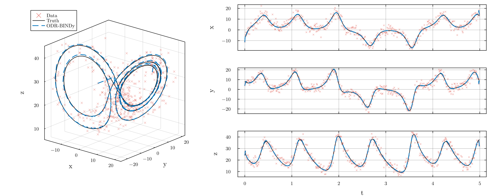

## Note

The reference implementation is
[ODR-BINDy](https://github.com/llfung/ODR-BINDy) in MATLAB, which is more mature
and is what the published results were produced with. Go check it out!

# Orthogonal Distance Regression based Bayesian Identification of Nonlinear Dynamics (ODRBINDy.jl)

Model discovery from noisy data for nonlinear dynamical systems, by jointly
denoising the trajectory and selecting model terms through maximising Bayesian
evidence.

Heavily inspired by [SINDy](https://github.com/dynamicslab/pysindy), but far
more noise robust than most SINDy variants and more akin to 4D-Var data
assimilation. There is no sparsity threshold to tune.

Julia port of [ODR-BINDy](https://github.com/llfung/ODR-BINDy) by L. Fung, the
code for [this article](https://doi.org/10.1145/3831701).



Lorenz63 from 500 samples with 20% noise (red), the settings of the paper's
Fig. 4. ODR-BINDy recovers the exact model,

```
dx/dt = -9.7203 * x + 9.7768 * y
dy/dt = 29.1935 * x - 1.2826 * y - 1.02 * x*z
dz/dt = -2.6546 * z + 0.9967 * x*y
```

and its denoised trajectory (dashed blue) sits on the truth (black), cutting
the RMS error from 2.58 to 0.38. Reproduce it with
[`examples/figures/lorenz_fig4_top.jl`](examples/figures/lorenz_fig4_top.jl).

Over 64 random trials per noise level (T = 10, the paper's noise definition),
the Julia port recovers the exact Lorenz63 model as often as the paper reports:

| Noise | Exact recovery (95% CI) | Paper |
|---|---|---|
| 10% | 100% (94–100%) | 100% |
| 20% | 100% (94–100%) | 100% |
| 30% | 97% (89–99%) | 90% |

Denoising cuts the mean state RMS error by about 90% at every level. The script
is [`benchmarks/lorenz_paper.jl`](benchmarks/lorenz_paper.jl), and the per-trial
results are in [`benchmarks/results/`](benchmarks/results/).

## Using the code

### Getting started

Run one of the examples in Julia at the top level folder and start exploring!

```
julia --project=. examples/lorenz.jl
```

### Using it on your own data

```julia
using ODRBINDy

lib  = PolynomialLibrary(3, 2; varnames = ["x", "y", "z"])     # candidate terms
prob = ODRProblem(X, t, lib;                                  # X is N x 3, t the sample times
                  discretisation = FiniteDifference(6),
                  sigma_x = 0.2 * std(vec(X)),                # noise beliefs
                  sigma_y = 1e-2, sigma_p = 1e2)

res = odr_bindy(prob)
print_model(res, lib)
```

Each `sigma` can be a number, one value per state, or a full matrix.

The solver and the model-selection strategy can be swapped or configured
independently (see [`docs/DESIGN.md`](docs/DESIGN.md)):

```julia
res = odr_bindy(prob; optimiser = BuiltinLM(damping = :levenberg, accel = true),
                      selector  = GreedyBackward(refine_maxiter = 16_000))
```

All four parts (the library, the discretisation, the optimiser and the model
selector) are pluggable, and the package provides alternatives for each:

| part | default | alternatives |
|---|---|---|
| library | `PolynomialLibrary` | `FourierLibrary`, `CustomLibrary`, `CombinedLibrary`, DataDrivenDiffEq `Basis` via `BasisLibrary` |
| discretisation | `FiniteDifference` | `FiniteDifference` on uneven samples, `WeakForm` |
| optimiser | `BuiltinLM` | any NonlinearSolve.jl algorithm via `NonlinearSolveOptimiser` |
| model selector | `GreedyBackward` | `BeamSearch`, `Exhaustive` |

[`docs/COMPONENTS.md`](docs/COMPONENTS.md) has a short example of each, and
[`examples/swap_components.jl`](examples/swap_components.jl) replaces all four
at once to identify a pendulum from unevenly sampled data.
[`docs/API.md`](docs/API.md) lists the public API, which is frozen for v1.0.

From Lorenz63 data at 20% noise (`examples/lorenz.jl`, 500 samples at
`dt = 0.01`), this recovers the exact 7-term support:

```
dx/dt = -9.8667 * x + 9.9345 * y
dy/dt = 27.7867 * x - 0.9967 * y - 0.9933 * x*z
dz/dt = -2.6803 * z + 0.9956 * x*y
```

against a truth of `-10, 10, 28, -1, -1, -8/3, 1`, while denoising the
trajectory from an RMS error of 1.62 down to 0.16.

### Installation

Requires `Julia 1.9+`, with no dependencies outside the standard library.
`BasisLibrary` and `NonlinearSolveOptimiser` become available when
DataDrivenDiffEq or NonlinearSolve is loaded (package extensions). Not yet
registered, so install from this repository:

```julia
julia> ]
pkg> add https://github.com/jamestr4n/odr-bindy-julia
```

## Documentation

[This paper](https://doi.org/10.1145/3831701) introduces the theoretical
background. You may also want to check out
[the previous work](https://royalsocietypublishing.org/doi/full/10.1098/rspa.2024.0200),
which detailed the advantage of selecting a model by maximising Bayesian
evidence.

For this port, [`docs/WALKTHROUGH.md`](docs/WALKTHROUGH.md) explains how each
source file implements the theory, and
[`docs/PORTING.md`](docs/PORTING.md) documents the correspondence with the
MATLAB implementation.

Documentation contributions are welcome. Get in touch!

## Future Work

So far only the Lorenz63 success rates at T = 10 have been reproduced (above).
The rest of the paper's Fig. 4 heatmap, other benchmark systems, a full test
suite and CI are still to do. Also planned: a `solve(prob, alg)` interface
matching the SciML conventions, and a parallelised greedy search.

Collaborators and contributions are welcome. Get in touch!

## Relevant packages

If your data is too large for `ODR-BINDy` but not too noisy, try
[`B-SINDy`](https://github.com/llfung/B-SINDy) — the same Bayesian model
selection, but a much faster linear-regression-based technique. There is also
[a MATLAB app](https://github.com/llfung/ODR-BINDy-MATLABApp) for 2D and 3D
systems, which runs without a MATLAB license.

## Note on dependency and license
This package has no dependencies outside the Julia standard library.
DataDrivenDiffEq and NonlinearSolve are optional (weak dependencies).

The algorithm and the reference MATLAB implementation are the work of L. Fung. This is an independent reimplementation in Julia; no source code from the original is reproduced here. Both are released under the MIT License — see LICENSE.
